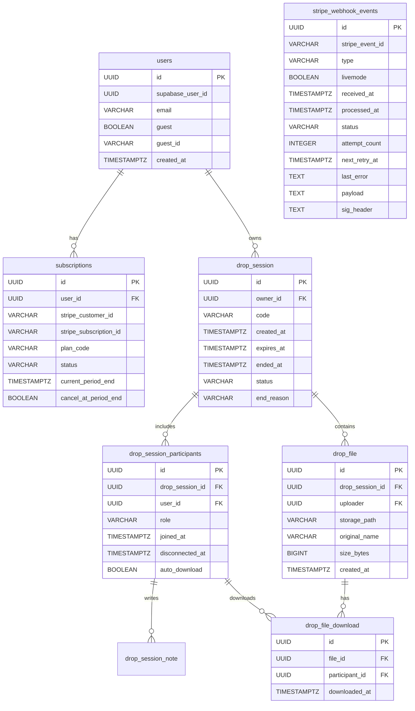

# LazyDrop Architecture

This document describes the internal backend modules and the core data model.

---

## Backend Module Structure

The backend follows a domain-modular structure:

```
com.lazydrop.modules/
├── session/
│   ├── core/          # Session lifecycle management
│   ├── file/          # Upload/download orchestration
│   ├── note/          # Note sharing
│   └── participant/   # Participant management + settings
├── billing/           # Stripe webhook processing
├── subscription/      # Subscription & plan enforcement
├── user/              # User identity resolution
├── storage/           # Supabase storage client (signed URLs)
└── websocket/         # STOMP event broadcasting
```

---

## Data Model (overview)



Notes:
- `stripe_webhook_events` supports idempotency + audit + retries
- Unique constraints enforce business invariants (session codes, event ids, one subscription per user)
