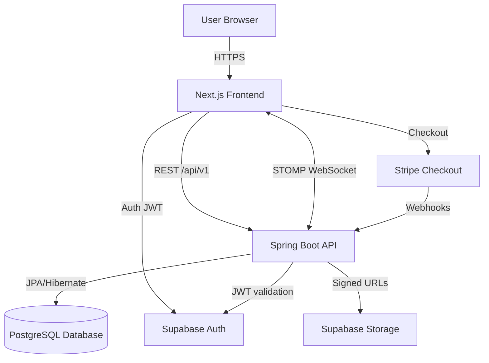
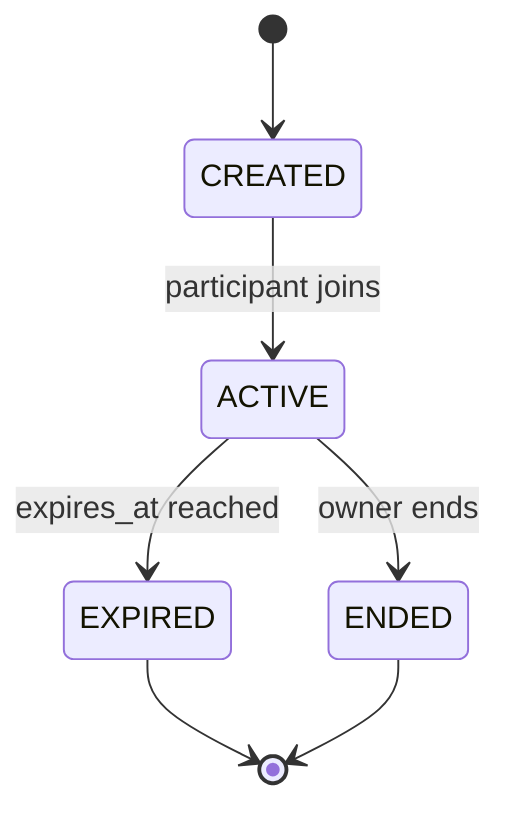
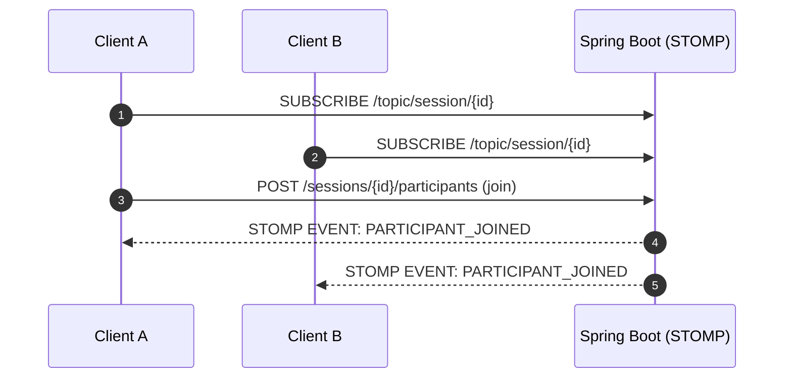
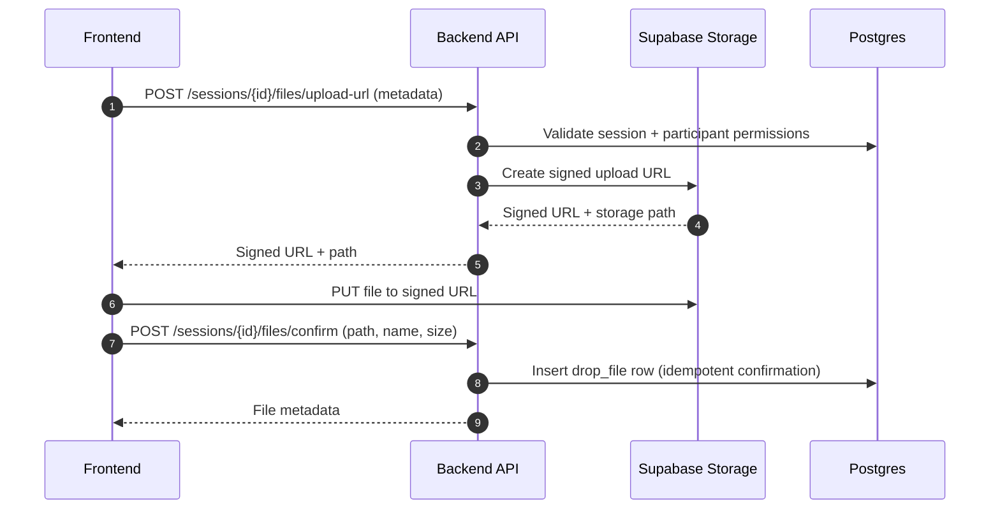
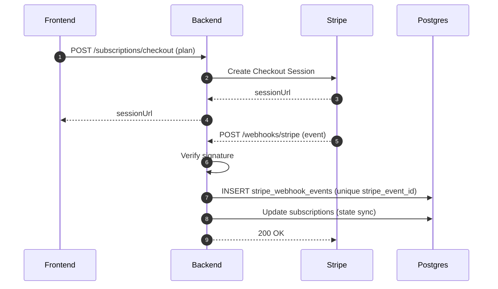
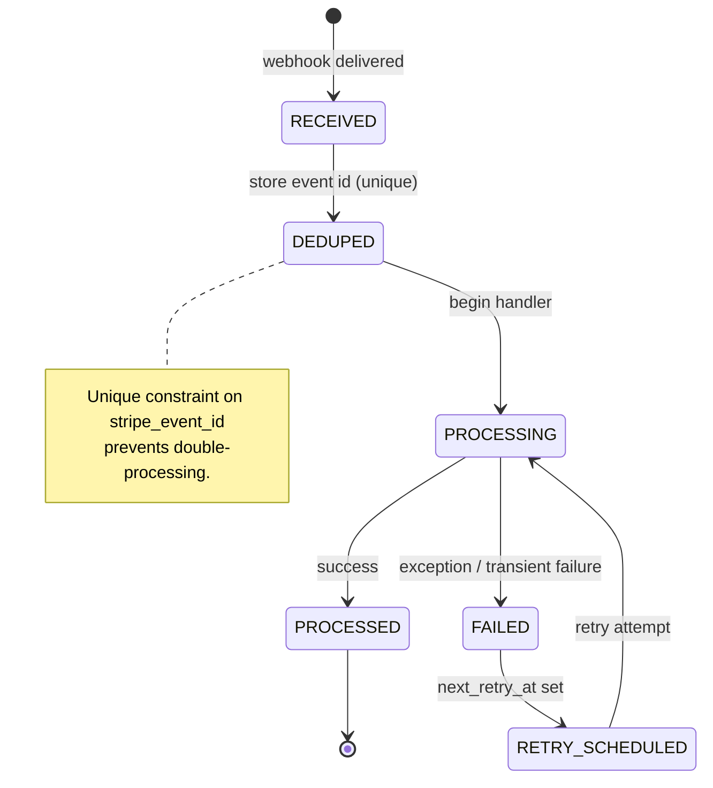
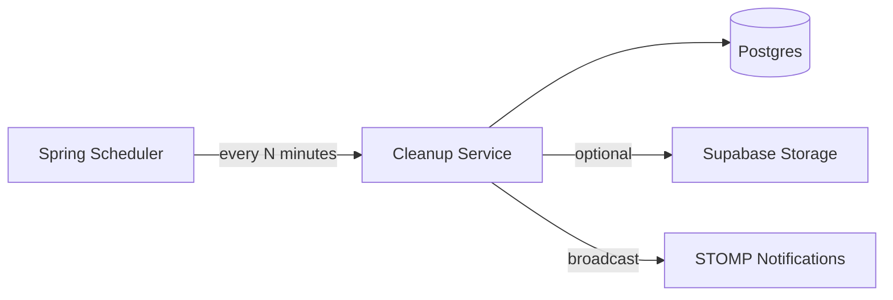

# LazyDrop System Design

This document describes the architecture and key backend patterns used in LazyDrop: real-time collaboration, signed uploads, subscription enforcement, and reliable Stripe webhook processing.

---

## High-Level Architecture

---

## Auth Model (Supabase JWT + Guest Cookies)

- Users authenticate with Supabase on the frontend and receive a JWT.
- The frontend calls the API with `Authorization: Bearer <token>`.
- Backend validates JWT using Spring Security OAuth2 Resource Server.
- Guests are supported using secure HTTP cookies (for session participation without requiring login).

---

## Session Lifecycle

A session is created, joined via short code/QR, and eventually ends via expiration or owner action.

Key DB optimizations:
- Unique session code constraint
- Indexes for active session lookups + expiry sweeps

---

## Real-time Collaboration (STOMP WebSockets)

Participants subscribe to a session topic (e.g. `/topic/session/{sessionId}`) and receive typed events such as:
- `PARTICIPANT_JOINED`
- `PARTICIPANT_LEFT`
- `FILE_UPLOADED`
- `NOTE_CREATED`
- `SESSION_ENDED`

---

## WebSocket Event Contract

These events are broadcast to session participants (example destination: `/topic/session/{sessionId}`).

| Event Type | Trigger | Typical Payload Fields |
|---|---|---|
| `PARTICIPANT_JOINED` | user joins a session | `sessionId`, `participantId`, `userId?`, `role`, `joinedAt` |
| `PARTICIPANT_LEFT` | user leaves a session | `sessionId`, `participantId`, `disconnectedAt`, `reason?` |
| `PARTICIPANT_SETTINGS_UPDATED` | user updates settings | `sessionId`, `participantId`, `autoDownload` |
| `FILE_UPLOAD_REQUESTED` | upload URL issued (optional broadcast) | `sessionId`, `uploaderParticipantId`, `storagePath`, `originalName`, `sizeBytes?` |
| `FILE_UPLOADED` | upload confirmed | `sessionId`, `fileId`, `storagePath`, `originalName`, `sizeBytes`, `createdAt`, `uploaderParticipantId` |
| `FILE_DOWNLOADED` | user marks download | `sessionId`, `fileId`, `participantId`, `downloadedAt` |
| `NOTE_CREATED` | note created | `sessionId`, `noteId`, `participantId`, `content`, `createdAt` |
| `SESSION_ENDED` | owner ends session or expiry | `sessionId`, `endedAt`, `endReason`, `status` |

> Tip: Keep payloads **versioned and explicit**. If you ever need breaking changes, introduce `v2` message types.

---

## Two-Phase File Upload (Signed URL Pattern)

Files are uploaded directly to Supabase Storage. The backend never receives file bytes.

1) Client requests a signed upload URL  
2) Client uploads directly to Supabase Storage  
3) Client confirms upload → backend writes metadata

Why two-phase matters:
- Prevents “phantom file” DB rows when users abandon uploads
- Confirmation endpoint can be retry-safe (idempotent)

---

## Stripe Payments + Webhook Reliability

LazyDrop uses Stripe subscriptions. Stripe can retry webhooks, so processing must be idempotent.

### Persistent webhook event log
Webhooks are stored in `stripe_webhook_events`:
- unique `stripe_event_id`
- payload + signature header
- status/attempt_count for auditing and retries

---

## Webhook Processing State Machine

Suggested statuses (example):
- `RECEIVED`, `PROCESSED`, `FAILED`

---

## Plan Enforcement (Server-side)

Plan limits are enforced on the backend so users cannot bypass rules by calling the API directly.

Examples:
- file size limits
- session count limits
- participants per session limits

This is enforced before resource creation (session creation, upload URL issuance, etc).

---

## Scheduled Cleanup Jobs

Automated background jobs keep the system clean and consistent:
- Expire sessions when `expires_at` is reached
- Cleanup unconfirmed uploads after a timeout window

---

## Scaling Notes

- API is stateless → horizontally scalable
- WebSockets require sticky sessions when scaled behind a load balancer
- Webhook handling can be split into a background worker for retries
- Presence tracking could move to Redis if needed
